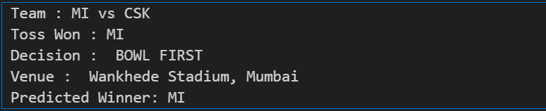

# 🏏 IPL Match Winner Prediction using Machine Learning

This project is a Machine Learning based system that predicts the **winner of an IPL match** using historical match data and real-time match inputs such as teams, toss result, venue, and current match statistics.

It demonstrates how data-driven models can be applied to sports analytics and highlights real-world challenges in building reliable ML systems.

---

## 📌 Features

- Predicts the winning team for any IPL match  
- Takes user inputs such as:  
  - Home Team  
  - Away Team  
  - Toss Winner  
  - Decision (Bat / Field)  
  - Venue  
  - Runs & Wickets of both teams  
- Uses Label Encoding for categorical features  
- Trained using Scikit-learn classifiers  
- Applies logical validation to ensure the predicted team is one of the playing teams  

---

## 🧠 Problem Solved

Initially, the model sometimes predicted a team that was **not even part of the match**  
(e.g., predicting MI for a SRH vs PBKS match).

This project fixes that issue by adding a **post-processing validation layer** that restricts the final output to only the two competing teams.

---

## 🛠️ Technologies Used

- Python  
- Pandas  
- NumPy  
- Scikit-learn  
- Matplotlib / Seaborn  

---

## 🔁 Project Workflow

1. Data Cleaning & Preprocessing  
2. Label Encoding of categorical variables  
3. Train-Test Split  
4. Model Training  
5. Winner Prediction Function  
6. Logical Validation of Output  

---

## 📂 Example Usage

```python
winner = predict_winner(
    home_team="MI",
    away_team="CSK",
    toss_won="MI",
    decision="BOWL FIRST",
    venue_name="Wankhede Stadium, Mumbai",
    # These values are always 0 before match starts
    home_runs=0,
    away_runs=0,
    home_wickets=0,
    away_wickets=0
)

print("Predicted Winner:", winner)
```

## Output

