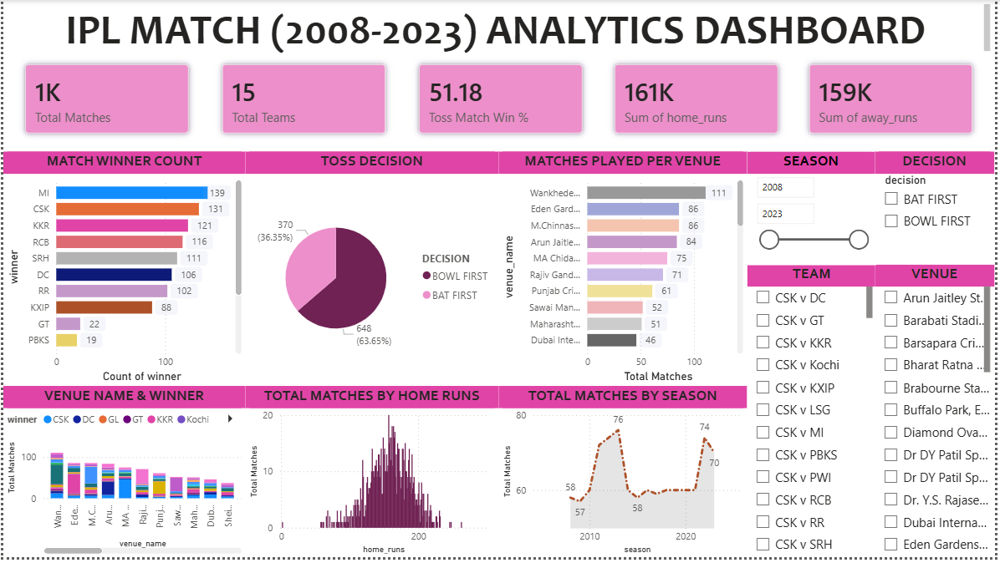

# 🏏 IPL Match Winner Prediction (2008–2023)

A Machine Learning project that predicts the winner of an IPL match using historical data and advanced analytics. This project combines **Exploratory Data Analysis (EDA)**, **feature engineering**, **Random Forest modeling**, and an **interactive Power BI dashboard** to deliver meaningful insights and predictions.

---

## 🚀 Project Overview

The goal of this project is to build a predictive model that can determine the likely winner of an IPL match based on key match conditions such as:

- Teams playing
- Toss winner & decision
- Venue
- Match statistics (runs, wickets, etc.)

This is formulated as a **classification problem**, where the output is the predicted winning team.

---

## 📊 Dashboard Preview

---

## 🔍 Key Features

- ✅ Cleaned and processed IPL dataset (2008–2023)
- ✅ Handled missing values and removed irrelevant columns
- ✅ Performed in-depth **EDA** to extract meaningful insights
- ✅ Applied **IQR method** for outlier handling
- ✅ Encoded categorical features using Label Encoding
- ✅ Built a **Random Forest Classifier**
- ✅ Achieved ~**70% accuracy**
- ✅ Developed a **prediction function** for real-time use
- ✅ Created an **interactive Power BI dashboard**

---

## 💡 Key Insights

- 🏆 Teams like **MI** and **CSK** consistently dominate
- 🏟️ **Venue** plays a significant role in match outcomes
- 🎯 Toss provides a slight advantage (~52%) but is not decisive
- 📈 Average match scores range between **150–180 runs**

---

## 🛠️ Tech Stack

- **Programming:** Python  
- **Libraries:** Pandas, NumPy, Scikit-learn, Matplotlib, Seaborn  
- **Visualization:** Power BI  
- **Environment:** Jupyter Notebook  

---

## 📈 Model Performance

- **Algorithm:** Random Forest Classifier  
- **Accuracy:** ~70%  
- **Evaluation Metrics:**
  - Confusion Matrix  
  - Precision, Recall, F1-score  

---

## ⚠️ Limitations

- Does not consider **player form or injuries**
- No **weather or pitch condition data**
- Predictions are based only on historical match data

---

## 🔮 Future Scope

- 🔹 Integrate **player-level statistics**
- 🔹 Use **real-time data APIs**
- 🔹 Implement **deep learning models**
- 🔹 Deploy as a **web application**

---

## 🔗 Project Links

- 📊 [Power BI Dashboard](https://lpuin-my.sharepoint.com/:u:/g/personal/aditya_singh237_lpu_in/IQAnhNJPD2ikTomvmr7pKWSXAYF_K0dWD6zaDMnnaWo4LLA?e=875Q66] )

---

## 🤝 Connect With Me

- 📧 [Email](mailto:adityasingh81201@gmail.com)
- 🔗 [LinkedIn](https://www.linkedin.com/in/aditya-kumar-singh-990377291/?skipRedirect=true)

---

## ⭐ If you found this project useful, consider giving it a star!
